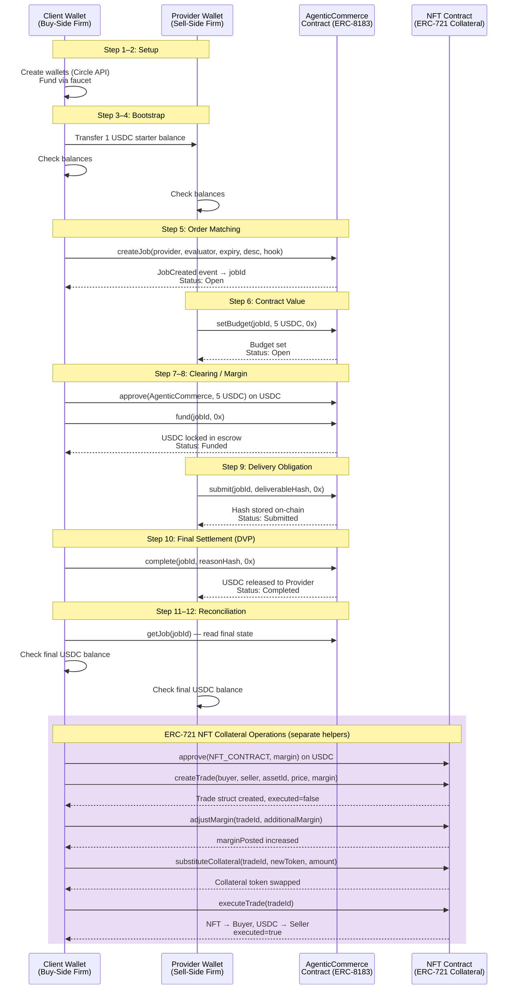

# Collateralized Trade Lifecycle on Circle ARC

This project implements a DeFi-style trade workflow on Circle ARC Testnet, mirroring the Solidity smart contracts in `CollateralizedTrade.sol` (ERC-20) and `CollateralizedTradeERC8183.sol` (ERC-721 for NFTs).

## Trade Lifecycle Diagram



## Settlement Comparison: Traditional vs On-Chain

Each step in this workflow maps directly to a stage in traditional capital markets post-trade processing — but compressed from days to minutes.

| Traditional Stage | Typical Timing | On-Chain Equivalent | Step(s) |
|---|---|---|---|
| Order Matching | T+0 | `createJob()` | Step 5 |
| Trade Confirmation & Affirmation | T+0 → T+1 | `setBudget()` | Step 6 |
| Clearing — CCP novation + margin call | T+1 | `approve()` + `fund()` | Steps 7–8 |
| Delivery Obligation (confirm to CCP) | T+1 → T+2 | `submit(deliverableHash)` | Step 9 |
| Settlement — DVP | T+2 (T+1 post SEC 2024 rule) | `complete()` — atomic on-chain | Step 10 |
| Reconciliation | T+2 → T+3 | `getJob()` + balance check | Steps 11–12 |

### Where the biggest difference lies: Clearing (Steps 7–8)

In traditional markets, clearing is handled by a Central Counterparty (CCP) such as DTCC. After a trade is matched at T+0, the CCP novates the trade and issues margin calls processed in **overnight batch windows** — creating a counterparty risk exposure window of up to 24 hours before collateral is actually locked.

On-chain, the smart contract *is* the CCP. `approve()` + `fund()` lock collateral in a single transaction sequence — there is no overnight window and no bilateral counterparty risk between execution and clearing.

### Time saved

| | Traditional | On-Chain |
|---|---|---|
| Execution → Clearing | ≈24 hours (T+0 to T+1) | Seconds |
| Clearing → DVP Settlement | ≈24 hours (T+1 to T+2) | Seconds |
| **Total (execution to settlement)** | **1–2 business days** | **Minutes** |

The clearing-to-settlement gap is eliminated entirely. Every step from order matching (Step 5) through final DVP (Step 10) executes sequentially on-chain within a single session, with per-transaction finality.

### Real-world example: BlackRock buys 1M TSLA shares from Goldman Sachs

> Assumed price: **$250/share → $250,000,000 notional**
> Assumed Fed Funds rate: 5.33% (252 trading days/year)

#### Traditional T+1 settlement via NYSE + DTCC/NSCC

| Cost Category | BlackRock (Buyer) | Goldman Sachs (Seller) | DTCC / CCP |
|---|---|---|---|
| NSCC clearing fee (~0.5 bps) | $1,250 | $1,250 | +$2,500 revenue |
| DTC settlement fee | $50 | $50 | +$100 revenue |
| Capital lock-up cost¹ (1 business day @ 5.33%) | **$52,877** | — | — |
| Short position hedging / stock borrow² | — | **$10,500** | — |
| Back-office: confirmation, affirmation, recon | $350 | $350 | — |
| **Total** | **$54,527** | **$12,150** | **$2,600 revenue** |

¹ Buyer must keep $250M cash earmarked and uninvested for the settlement window: $250M × 5.33% ÷ 252 = $52,877/day.  
² Goldman holds a short overnight to deliver on T+1. Stock borrow at ~1% annualised: $250M × 1% ÷ 252 ≈ $9,921, plus back-office overhead.

**Combined cost to both trading parties: ~$66,677**

#### On-chain settlement (this implementation)

| Cost Category | BlackRock (Client Wallet) | Goldman Sachs (Provider Wallet) | Smart Contract |
|---|---|---|---|
| Gas fees (~10 transactions on ARC) | ~$5 | ~$5 | — |
| Capital lock-up | $0 | $0 | — |
| Back-office processing | $0 (automated) | $0 (automated) | — |
| **Total** | **~$5** | **~$5** | **$0** |

**Combined cost to both trading parties: ~$10**

#### Savings summary

| Party | Traditional | On-Chain | **Saved** |
|---|---|---|---|
| BlackRock (buy-side) | $54,527 | $5 | **$54,522** |
| Goldman Sachs (sell-side) | $12,150 | $5 | **$12,145** |
| DTCC / CCP | — | — | Disintermediated |
| **All parties combined** | **$66,677** | **$10** | **$66,667 (99.99%)** |

DTCC is disintermediated entirely — the smart contract enforces the same novation and collateral-locking guarantees that the CCP provides, but without the overnight batch cycle or clearing fund contribution.

At BlackRock's reported ≈$500B/day in equity trading volume, even routing **0.01%** of that through on-chain settlement would yield **≈$1.3M/day** in capital cost savings from the settlement window alone.

### Risks in today's capital market ecosystem

The cost savings above are real, but so are the adoption barriers. These are the live risks that any institution faces when moving post-trade infrastructure on-chain today, alongside how Circle and ARC directly address each one.

| # | Risk | Core issue in today's market | How Circle / ARC mitigates it |
|---|---|---|---|
| 1 | **Loss of multilateral netting** | NSCC reduces gross settlement volumes by ~95% daily by netting offsetting obligations across all participants. On-chain gross settlement means 10 trades of 1M TSLA still require 10 full $250M settlements — not one net — potentially reversing the capital savings at scale. | Circle's programmable wallet infrastructure on ARC can implement a **netting smart contract layer**: multiple bilateral trades are aggregated intra-day and a single net settlement transaction is submitted, replicating NSCC-style netting without the overnight batch cycle. |
| 2 | **Legal finality ≠ blockchain finality** | UCC Article 8 and registered clearing agency rules govern legal settlement finality in the US. A smart contract `complete()` has no standing under these rules today — on-chain state says "settled" while courts may not. | Circle actively engages with US and EU regulators (NYDFS, SEC, MiCA framework) on regulatory recognition of on-chain settlement. ARC is designed as a **compliant institutional chain**; Circle's legal team supports clients in structuring transactions that align on-chain finality with UCC Article 12 (enacted 2023) which explicitly recognises controllable electronic records as property. |
| 3 | **KYC/AML and accredited investor compliance** | Traditional settlement passes through FINRA-registered broker-dealers who perform KYC, AML screening, and suitability checks. Wallet addresses carry none of this context natively. | Circle's **Developer-Controlled Wallets API enforces identity verification at wallet provisioning** — wallets are issued only to entities that pass Circle's compliance layer. Circle holds money transmitter licences in 49 US states and an EU e-money licence, making the wallet layer itself a regulated touchpoint rather than an anonymous address. |
| 4 | **No erroneous trade / bust-trade mechanism** | FINRA Rule 11890 and exchange clearly-erroneous trade policies allow post-execution cancellation. An on-chain `complete()` is irreversible — no circuit breaker or regulatory halt can override a settled transaction. | The `admin` role in ARC's smart contracts (visible in `NFT_ABI` in this repo) provides a Circle-governed **emergency intervention key**. On ARC's permissioned validator set, Circle and institutional co-validators can coordinate a time-locked dispute window — analogous to a T+0 bust-trade window — before a transaction achieves full legal finality. |
| 5 | **Stablecoin peg risk** | A temporary USDC depeg during Steps 7–10 means the buyer delivers $250M nominal USDC worth less in USD at DVP. Traditional settlement uses central bank money (Fedwire) with no peg risk. Tokenised equities add issuer redemption risk on top. | USDC is Circle's own product — **fully reserved 1:1 by cash and short-dated US Treasuries**, attested monthly by Deloitte, and has maintained its peg since launch. On ARC, USDC is the **native settlement currency** with no bridge or wrapping risk. Circle's reserve transparency and regulatory standing are the closest analogue to central bank money available in the tokenised asset ecosystem today. |
| 6 | **MEV and front-running** | A pending `createJob()` or `fund()` on a public mempool reveals trade direction, size, and price before confirmation. Validators and searchers can front-run or sandwich the transaction, repricing the trade against the initiating party. | ARC operates a **permissioned validator set** of institutional participants — not anonymous miners or public stakers. Transactions are submitted through Circle's private RPC endpoint, bypassing any public mempool entirely. Block production is controlled, making MEV extraction structurally impossible without explicit collusion among the whitelisted validators. |
| 7 | **Custody and key management** | SEC Rule 15c3-3 and the Investment Advisers Act impose strict custody requirements. Loss or compromise of the Circle entity secret results in permanent asset loss — no SIPC protection, no legal recourse equivalent to a qualified custodian. | Circle's Developer-Controlled Wallets use **MPC (Multi-Party Computation)** key management backed by HSMs (Hardware Security Modules), distributing key shards so that no single point of compromise is sufficient. Circle is a licensed money transmitter and is pursuing a US federal bank charter, positioning it as a **qualified custodian** under SEC rules — giving institutional clients the regulatory custody coverage required by the Investment Advisers Act. |

## Low-Impact Adoption Strategy: Traditional Exchange → ARC Settlement

A "big bang" migration from DTCC to on-chain settlement is neither realistic nor safe. The strategy below is designed so that an exchange adds ARC as a parallel settlement rail and shifts volume incrementally — each phase producing measurable savings with no risk to the existing participant base.

### Guiding principles

- **No forced migration** — existing T+1/DTCC settlement continues throughout every phase
- **Start with net-new** — onboard assets that have no legacy settlement infrastructure first
- **Opt-in before mandate** — participants choose to use ARC; it is never imposed
- **API-first integration** — ARC bolts onto the exchange's existing OMS/post-trade stack via Circle's Developer-Controlled Wallets API without replacing it

---

### Phase 1 — Shadow mode (0% volume shift, 0 participant impact)

**What happens:** The exchange runs ARC settlement in parallel with DTCC for a subset of trades — comparing results, timing, and cost — without routing any real settlement obligation through ARC. Participants see nothing different.

**What to build:**
- Connect exchange's trade feed to `createJob()` / `fund()` / `complete()` on ARC testnet for every matched trade
- Log on-chain settlement time vs. DTCC T+1 confirmation time side-by-side
- Validate that `getJob()` state matches DTCC confirmed status for every trade

**Circle/ARC tools used:** Developer-Controlled Wallets API, ARC Testnet RPC, `arcscan` for audit trail

**Exit criterion:** 30 consecutive trading days with zero state divergence between ARC shadow log and DTCC settlement record.

---

### Phase 2 — Tokenised new listings (≈5–10% volume)

**What happens:** New securities listed on the exchange are issued as tokenised assets on ARC from day one. They have no pre-existing DTCC settlement infrastructure, so there is nothing to migrate. Buyers and sellers of these instruments settle entirely on-chain via DVP.

**What to build:**
- Issue new listings as ERC-20 (fungible) or ERC-721 (NFT for unique instruments) on ARC
- Provision participant wallets through Circle's Developer-Controlled Wallets API — participants interact through existing order management interfaces; the wallet layer is invisible
- Map `createJob()` → order match, `fund()` → clearing, `complete()` → DVP settlement

**Regulatory consideration:** File with the SEC under the existing ATS (Alternative Trading System) exemption or seek a no-action letter for tokenised securities settlement. Circle's regulatory team has established relationships with NYDFS and the SEC to support this process.

**Exit criterion:** 6 months of clean settlement on tokenised listings with no failed DVPs and participant satisfaction scores matching or exceeding DTCC SLAs.

---

### Phase 3 — Block trade opt-in for institutional counterparties (≈15–25% volume)

**What happens:** Large negotiated block trades (e.g. >$50M notional) between two institutions are offered an opt-in ARC settlement path. Both counterparties must consent. The trade is bilateral, so there is no multilateral netting impact (Phase 1 identified this as the key structural risk).

**What to build:**
- Add an "ARC Settlement" toggle to the block trade negotiation UI
- When both sides opt in, route through `createJob()` → `setBudget()` → `approve()` → `fund()` → `submit()` → `complete()` within a single session
- Maintain a DTCC fallback: if either side's `fund()` fails within a timeout, revert and fall back to standard T+1

**Savings unlocked:** The full $66,667 per $250M trade modelled in the BlackRock/Goldman example applies here. At 20 such block trades per month, that is ≈$1.3M/month in participant cost savings — a tangible incentive for opt-in.

**Exit criterion:** 80% of eligible block trade counterparties actively choosing ARC settlement within 12 months.

---

### Phase 4 — Default settlement for eligible securities (≈50–60% volume)

**What happens:** ARC becomes the default settlement rail for all tokenised assets and all securities where both counterparties have active Circle wallets provisioned. DTCC remains the fallback for participants who have not yet onboarded.

**What to build:**
- Implement on-chain multilateral netting contract: aggregate all bilateral trades intra-day per security, net positions, submit a single gross settlement per participant per day — replicating NSCC netting and recovering the netting efficiency identified as a Phase 1 risk
- Automate wallet provisioning at account opening so every new participant gets a Circle wallet by default

**Regulatory milestone required:** Exchange must obtain recognition from the SEC that ARC settlement constitutes legal settlement finality (UCC Article 12 framework) before mandating this phase.

**Exit criterion:** Net settlement volumes on ARC match or beat DTCC netting efficiency (≥90% reduction in gross obligations).

---

### Phase 5 — Full migration, DTCC as backstop only (≈95–100% volume)

**What happens:** ARC handles all settlement. DTCC connectivity is maintained purely as a regulatory backstop and for cross-market interoperability (e.g. trades that cross into non-ARC venues). The overnight batch cycle is eliminated.

**Outcome at scale:**

| Metric | Traditional (DTCC) | ARC (Phase 5) |
|---|---|---|
| Settlement window | T+1 (24 hrs) | Minutes |
| Failed trade rate | ≈0.3% (industry avg) | Near zero (atomic DVP) |
| Capital locked in settlement pipeline | ≈2× daily volume | ≈0 |
| CCP clearing fee per $250M trade | $2,600 | $0 |
| Participant capital cost per $250M trade | $66,677 | $10 |

---

### Migration risk controls at every phase

| Control | Mechanism |
|---|---|
| Fallback to DTCC | Every on-chain flow has a timeout; unresolved trades revert to T+1 automatically |
| Admin intervention | `admin` key on ARC contracts allows Circle + exchange to cancel and re-route within the dispute window |
| Participant opt-out | Any participant can revert to DTCC settlement at any phase without penalty |
| Regulatory checkpoint | Each phase requires explicit sign-off from exchange compliance and legal before volume is shifted |

## Recommendations for Exchanges

Four questions every exchange legal, technology, and operations team raises when evaluating on-chain settlement — with specific answers grounded in how ARC and this implementation work.

---

### 1. Where exactly do you remove or replace the role of a clearinghouse?

A clearinghouse (CCP) performs six distinct functions. They are not all equally replaceable on day one.

| CCP Function | Replaceable on ARC? | How |
|---|---|---|
| **Novation** — CCP becomes counterparty to both sides | Partially | The smart contract enforces bilateral obligations atomically. There is no novation (both parties' identities remain visible), but counterparty default risk is eliminated by requiring collateral lock-up before settlement proceeds. |
| **Multilateral netting** — reduces gross settlement by ≈95% | No (by default) | Requires a separate netting smart contract deployed on ARC that aggregates intra-day bilateral trades per security, nets positions, and submits a single gross settlement per participant per day. This is a Phase 4 build. |
| **Margin/collateral management** — initial margin, variation margin | Yes — directly | `approve()` + `fund()` in this implementation *are* the margin posting mechanism. USDC locked in contract escrow is the margin account. No CCP intermediary required. |
| **Risk mutualization** — guaranty fund backstops member defaults | No (by default) | No guaranty pool equivalent exists on ARC today. Recommendation: deploy a Circle-governed guaranty pool smart contract funded by clearing member contributions — a direct on-chain analogue to NSCC's guaranty fund. |
| **Settlement finality** — legal irrevocability of transfer | Technically yes, legally not yet | Blockchain finality is technically stronger than DTCC finality (irreversible vs. book-entry). Legal recognition under UCC Article 12 (enacted 2023) is the regulatory milestone needed to close this gap. |
| **Default management** — waterfall for insolvent member | No (by default) | The `admin` key provides intervention capability, but there is no formal default waterfall (own resources → margin → guaranty fund → assessment). This must be explicitly designed for Phase 4–5. |

**Bottom line:** Remove the CCP's novation and margin functions immediately — the smart contract replaces them directly. Netting, risk mutualization, and default management require additional contracts built on top of ARC before the CCP can be fully decommissioned.

---

### 2. How would USDC interact with custodians and prime brokers?

Three specific integration points each require a different answer.

**USD → USDC conversion at the prime broker layer**
Prime brokers currently hold client cash in money market funds, repos, and demand deposit accounts, funding DTC settlement via Fedwire. To use USDC, they need to offer USDC accounts alongside USD accounts. Circle's Developer-Controlled Wallets API is the integration point: the prime broker becomes a Circle API partner, provisions a wallet per client, and handles USD ↔ USDC conversion internally. This requires either a money transmitter licence or a direct Circle partnership agreement — both of which Circle actively supports for institutional onboarding.

**Custodians recognising on-chain settlement as the record of title**
Today, custodians read DTC position files (delivered nightly) as the authoritative record of client holdings. In an ARC world, the custodian needs to read ARC's blockchain state via the RPC endpoint as the equivalent authoritative source. Practically: custodians (BNY Mellon, State Street, JPMorgan Custody) integrate ARC's `getJob()` and on-chain balance queries into their reconciliation systems. Circle's institutional RPC access and the publicly auditable ledger make this straightforward technically; the barrier is internal systems integration, not infrastructure availability.

**Prime brokerage functions: margin lending, securities lending, rehypothecation**
- *Margin lending*: Prime brokers lend USDC against tokenised securities as collateral. The smart contract `adjustMargin()` function in this repo handles variation margin calls. Initial margin lending requires the prime broker to hold USDC liquidity — a treasury function, not a technical one.
- *Securities lending*: Stock borrow/loan moves on-chain as ERC-721 (for unique instruments) or ERC-20 transfers with time-locked return obligations. The `substituteCollateral()` function in this repo models how collateral can be swapped — the same mechanism applies to lending returns.
- *Rehypothecation*: Prime brokers rehypothecate client assets by re-pledging them against their own obligations. On ARC, this requires explicit smart contract logic granting the prime broker a limited transfer right on client-held tokens — a permissions model, not a protocol limitation.

---

### 3. What breaks if we try to use USDC in today's T+1 equity markets?

Seven specific rules and systems break before a single trade settles. This is why Phase 2 of the adoption strategy targets net-new tokenised securities — not existing equities.

| What breaks | Why |
|---|---|
| **Regulation T (12 CFR 220)** | Reg T requires payment in "good funds" — currently defined as bank wire or cash equivalents. The SEC has not issued guidance recognising USDC as good funds. Brokers cannot legally accept USDC for marginable securities without a no-action letter. |
| **SEC Rule 15c3-3 (Customer Protection Rule)** | Broker-dealers must hold customer funds in a special reserve bank account. Qualifying assets are explicitly enumerated: cash, US government securities, etc. USDC does not qualify. Holding client USDC as a reserve asset puts the broker in violation. |
| **DTCC/DTC settlement infrastructure** | DTC settles the cash leg in USD only via book-entry. There is no USDC settlement rail at DTC. Even if both counterparties agree to settle in USDC, DTC still requires a USD delivery — you cannot substitute USDC on the existing rail without building a parallel one. |
| **FINRA Rule 4210 (Margin Requirements)** | Margin calculations, portfolio margin, and day-trading margin requirements are all denominated in USD. USDC introduces a basis (≠1 USD, even transiently) that creates compliance questions in margin deficiency calculations. |
| **Fedwire interoperability** | Prime brokers fund DTC accounts via Fedwire. USDC cannot travel through Fedwire. Moving to USDC requires parallel liquidity infrastructure completely separate from the existing intraday credit and funding mechanisms. |
| **Corporate actions (dividends, splits, rights)** | Issuers pay dividends in USD through DTC's Dividend Payment Mechanism. Tokenised securities need a USDC dividend distribution mechanism that does not yet exist — or a USD-to-USDC conversion layer at the point of payment. |
| **Fails and buy-in rules (SEC Rule 204)** | Rule 204 mandates that fails be closed via buy-in within 2 settlement days. The buy-in process uses USD, not USDC, and is administered by the prime broker and DTC jointly. A USDC settlement rail has no legal hook into the Rule 204 close-out process. |

**The correct interpretation:** these are not permanent blockers — they are rules written for a USD-only world. Each has a regulatory path (no-action letter, rulemaking, guidance). The practical recommendation is to avoid the existing T+1 rail entirely and build the USDC settlement path on ARC for instruments that are born tokenised, where none of these rules apply by default.

---

### 4. How do you handle fails, reversals, or disputes in an irreversible system?

Each scenario has a distinct answer because the cause and timing differ.

**Fails — pre-settlement failure to deliver**

In traditional markets, a fail occurs when a seller cannot deliver shares by T+1. DTCC carries the fail forward (with penalties) until a buy-in is executed. On ARC, a fail cannot happen in the same way: `fund()` requires the seller's wallet to hold the asset before the transaction is confirmed. If the seller cannot fund, the transaction reverts atomically — the buyer's USDC is never moved. The fail is prevented at the protocol level rather than managed after the fact.

What replaces the buy-in: if the seller's wallet is consistently unable to fund (e.g. the tokenised asset was never delivered to them from the issuer), the exchange's `admin` key can trigger a compensating `createJob()` in the opposite direction at the same price — an on-chain buy-in — funded from a Circle-governed default pool.

**Reversals — bust trades and clearly erroneous executions**

Once `complete()` is confirmed, the original transaction is irreversible at the protocol level. The mechanism for reversal is a **compensating transaction**: the exchange deploys a new `createJob()` in the opposite direction (seller becomes buyer, buyer becomes seller) at the original price, which when `complete()`-d returns both parties to their pre-trade positions economically. This is analogous to how DTC handles busts today — it does not literally reverse the book entry, it creates an offsetting one.

The key design addition needed: a **time-locked release window** after `complete()`. Concretely: USDC moves from buyer's wallet into contract escrow at `fund()`, and from escrow to seller's wallet only after a configurable hold period (e.g., 4 hours). During that window, the `admin` key can freeze the escrow and initiate the compensating transaction. After the window, the release is automatic. This adds at most 4 hours to settlement — still far inside T+1.

**Disputes — post-settlement disagreements**

On-chain state is the authoritative record. `getJob()` returns an immutable struct with all trade parameters, both wallet addresses, the amount, and the timestamp — stronger audit evidence than DTC's paper confirmation in most dispute contexts.

Escalation path for disputes on ARC:

```
On-chain evidence (getJob() output)
        ↓
Circle admin governance review (admin key, time-locked escrow)
        ↓
Exchange internal dispute committee
        ↓
FINRA arbitration (off-chain, using on-chain record as primary evidence)
        ↓
Courts (UCC Article 12 digital asset transfer rules)
```

The practical recommendation: add a `raiseDispute(jobId)` function to the smart contract callable by either counterparty within the hold window. Raising a dispute freezes the escrow and routes the job ID to the exchange's compliance queue. This replicates DTC's "don't know" (DK) mechanism — a formal signal that a party contests the settlement — without requiring any off-chain communication before the funds freeze.

## Features

- Trade execution (buyer & seller agreement)
- Clearing (validate trade, lock collateral)
- Initial margin posting (escrow)
- Variation margin (adjust collateral)
- Collateral movement (substitute/reallocate)
- Settlement (DVP: deliver asset, release funds)
- Balance and job status tracking

## Setup

1. Deploy one of the contracts on Circle ARC Testnet:
   - `CollateralizedTrade.sol`: For ERC-20 tokenized assets
   - `CollateralizedTradeERC8183.sol`: For ERC-721 NFT assets
   Provide USDC and asset token addresses as constructor arguments.

   **Deployment using Python script:**
   - Add `PRIVATE_KEY` to your `.env` file (account with testnet funds).
   - Update `usdc_address` and `asset_address` in `deploy_contract.py` (find testnet token addresses or deploy your own ERC-20/ERC-721).
   - Set `contract_file` to the desired contract.
   - Run: `python deploy_contract.py`

   Alternatively, use Remix IDE or Hardhat:
   - Connect to Circle ARC testnet RPC: `https://rpc.testnet.arc.network`
   - Deploy with constructor args.

2. Create a virtual environment and activate it:
   ```bash
   python -m venv circle
   source circle/bin/activate
   ```

3. Install dependencies:
   ```bash
   pip install -r requirements.txt
   ```

4. Set environment variables in a `.env` file:
   ```
   CIRCLE_API_KEY=your_api_key
   CIRCLE_ENTITY_SECRET=your_entity_secret
   PRIVATE_KEY=your_private_key  # For contract deployment (see below)
   ```

   **Getting a Private Key:**
   - Use a wallet like MetaMask: Create or import an account, then export the private key (Account > Export Private Key).
   - For testnet, create a new account to avoid using mainnet keys.
   - Fund the account with testnet ETH (faucet for Circle ARC or Polygon Mumbai if applicable).
   - **Security Warning:** Never share or commit private keys. Use environment variables and keep them secure.

5. Update the constants in the appropriate Python file:
   - `TRADE_CONTRACT`: Use the deployed address (e.g., `0xe185f2E0ebf96638bfCe09FC6b77d36d17FCC32c`)
   - `USDC_ADDRESS`: USDC contract address on testnet
   - `ASSET_ADDRESS`: Asset token contract address
   - For NFT: `ASSET_ID`: Token ID to trade

## Usage

Run the main script:
```bash
python collateralized_trade.py
```

This runs the full ERC-8183 Agentic Commerce trade lifecycle (Steps 1–12). NFT collateral operations (`create_nft_trade`, `adjust_nft_margin`, `execute_nft_trade`, `substitute_nft_collateral`) are defined in the same file and can be called directly after completing the main flow.

The script will:
- Create buyer and seller wallets
- Fund and transfer initial collateral
- Create a job for the trade
- Set budget
- Perform approval, escrow funding, margin adjustments, collateral substitution
- Submit deliverable
- Complete the job
- Print final balances and status

## Notes

- Ensure you have sufficient funds in testnet for transactions.
- The contract ABI is mocked; replace with actual ABI from your Solidity contract.
- Transactions wait for on-chain confirmation with retries.
- Atomicity is ensured via job budgeting and transaction sequencing.

