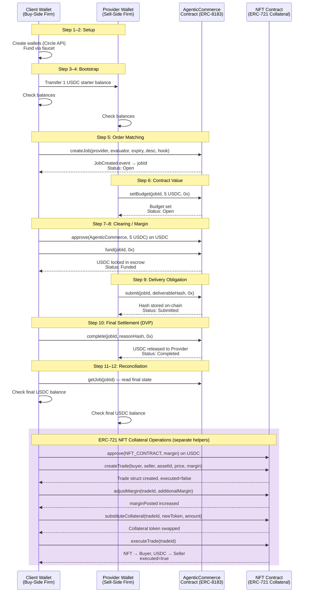

# Collateralized Trade Lifecycle on Circle ARC

This project implements a DeFi-style trade workflow on Circle ARC Testnet, mirroring the Solidity smart contracts in `CollateralizedTrade.sol` (ERC-20) and `CollateralizedTradeERC8183.sol` (ERC-721 for NFTs).

```
(circle) vamsi@Mac Arch-DeFi-Sample % python deploy_contract.py
Deploying from account: 0xaA6Ed569148c006514cb4520Ba8Dbd24052da6dc
Account balance: 20 ETH
Contract deployed at: 0xe185f2E0ebf96638bfCe09FC6b77d36d17FCC32c
Transaction hash: 49a98381225d63a060d4d02b168a6588b8d596160316fd57ccfe595910efe554
(circle) vamsi@Mac Arch-DeFi-Sample % 
```

## Trade Lifecycle Diagram



## Settlement Comparison: Traditional vs On-Chain

Each step in this workflow maps directly to a stage in traditional capital markets post-trade processing — but compressed from days to minutes.

| Traditional Stage | Typical Timing | On-Chain Equivalent | Step(s) |
|---|---|---|---|
| Order Matching | T+0 | `createJob()` | Step 5 |
| Trade Confirmation & Affirmation | T+0 → T+1 | `setBudget()` | Step 6 |
| Clearing — CCP novation + margin call | T+1 | `approve()` + `fund()` | Steps 7–8 |
| Delivery Obligation (confirm to CCP) | T+1 → T+2 | `submit(deliverableHash)` | Step 9 |
| Settlement — DVP | T+2 (T+1 post SEC 2024 rule) | `complete()` — atomic on-chain | Step 10 |
| Reconciliation | T+2 → T+3 | `getJob()` + balance check | Steps 11–12 |

### Where the biggest difference lies: Clearing (Steps 7–8)

In traditional markets, clearing is handled by a Central Counterparty (CCP) such as DTCC. After a trade is matched at T+0, the CCP novates the trade and issues margin calls processed in **overnight batch windows** — creating a counterparty risk exposure window of up to 24 hours before collateral is actually locked.

On-chain, the smart contract *is* the CCP. `approve()` + `fund()` lock collateral in a single transaction sequence — there is no overnight window and no bilateral counterparty risk between execution and clearing.

### Time saved

| | Traditional | On-Chain |
|---|---|---|
| Execution → Clearing | ~24 hours (T+0 to T+1) | Seconds |
| Clearing → DVP Settlement | ~24 hours (T+1 to T+2) | Seconds |
| **Total (execution to settlement)** | **1–2 business days** | **Minutes** |

The clearing-to-settlement gap is eliminated entirely. Every step from order matching (Step 5) through final DVP (Step 10) executes sequentially on-chain within a single session, with per-transaction finality.

## Features

- Trade execution (buyer & seller agreement)
- Clearing (validate trade, lock collateral)
- Initial margin posting (escrow)
- Variation margin (adjust collateral)
- Collateral movement (substitute/reallocate)
- Settlement (DVP: deliver asset, release funds)
- Balance and job status tracking

## Setup

1. Deploy one of the contracts on Circle ARC Testnet:
   - `CollateralizedTrade.sol`: For ERC-20 tokenized assets
   - `CollateralizedTradeERC8183.sol`: For ERC-721 NFT assets
   Provide USDC and asset token addresses as constructor arguments.

   **Deployment using Python script:**
   - Add `PRIVATE_KEY` to your `.env` file (account with testnet funds).
   - Update `usdc_address` and `asset_address` in `deploy_contract.py` (find testnet token addresses or deploy your own ERC-20/ERC-721).
   - Set `contract_file` to the desired contract.
   - Run: `python deploy_contract.py`

   Alternatively, use Remix IDE or Hardhat:
   - Connect to Circle ARC testnet RPC: `https://rpc.testnet.arc.network`
   - Deploy with constructor args.

2. Create a virtual environment and activate it:
   ```bash
   python -m venv circle
   source circle/bin/activate
   ```

3. Install dependencies:
   ```bash
   pip install -r requirements.txt
   ```

4. Set environment variables in a `.env` file:
   ```
   CIRCLE_API_KEY=your_api_key
   CIRCLE_ENTITY_SECRET=your_entity_secret
   PRIVATE_KEY=your_private_key  # For contract deployment (see below)
   ```

   **Getting a Private Key:**
   - Use a wallet like MetaMask: Create or import an account, then export the private key (Account > Export Private Key).
   - For testnet, create a new account to avoid using mainnet keys.
   - Fund the account with testnet ETH (faucet for Circle ARC or Polygon Mumbai if applicable).
   - **Security Warning:** Never share or commit private keys. Use environment variables and keep them secure.

5. Update the constants in the appropriate Python file:
   - `TRADE_CONTRACT`: Use the deployed address (e.g., `0xe185f2E0ebf96638bfCe09FC6b77d36d17FCC32c`)
   - `USDC_ADDRESS`: USDC contract address on testnet
   - `ASSET_ADDRESS`: Asset token contract address
   - For NFT: `ASSET_ID`: Token ID to trade

## Usage

Run the script corresponding to your deployed contract:
- For ERC-20 assets: `python collateralized_trade.py`
- For ERC-721 NFT assets: `python collateralized_trade_nft.py`

The script will:
- Create buyer and seller wallets
- Fund and transfer initial collateral
- Create a job for the trade
- Set budget
- Perform approval, escrow funding, margin adjustments, collateral substitution
- Submit deliverable
- Complete the job
- Print final balances and status

## Notes

- Ensure you have sufficient funds in testnet for transactions.
- The contract ABI is mocked; replace with actual ABI from your Solidity contract.
- Transactions wait for on-chain confirmation with retries.
- Atomicity is ensured via job budgeting and transaction sequencing.

